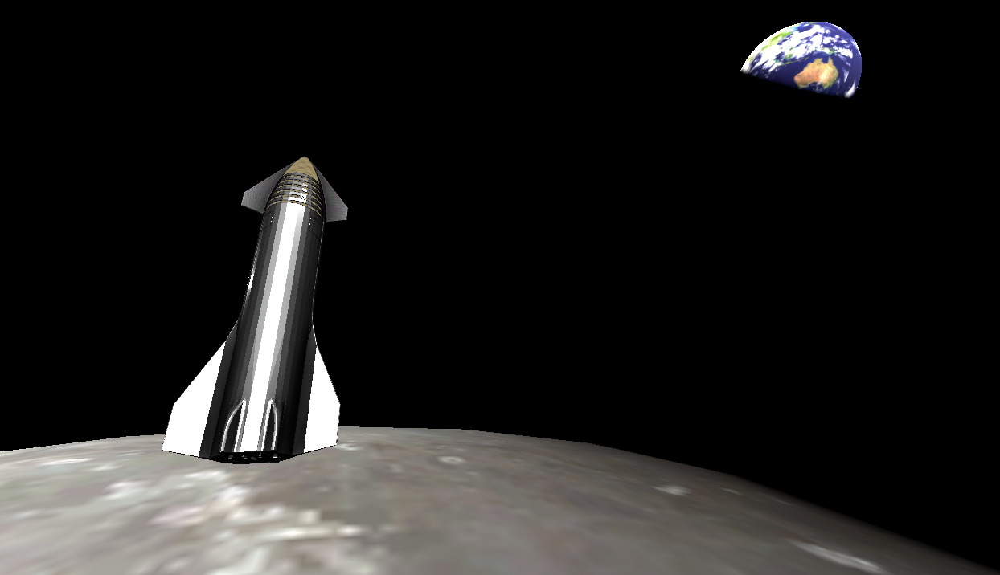

# LunCo – Lunar Colony sim

## What it is

LunCo – **Lunar Colony** *digital twin* inspired by Factorio, SimCity, Kerbal Space Program and others. 

It's a *game* and a *scientific tool*.

1. Precise enough to plan real mission
2. Training as space engineer
3. Economics

## Gameplay

Collect resources, build factories, manufacture robots and to build sustaiable lunar base.

You are playing as a CEO&Founder of a NewSpace Lunar exploration company in the nearest future. 

You want to make the Moon forpost of human civilization in space in order to colonize the whole Solar system.

## What to expect

1. Supply chain management as in Factorio
2. Robot&rocket control as in KSP
3. City management as in SimCity
4. Economics
5. Realistic technologies, physics and enviroment. E.g. you have to extract ~30-50 of different raw resources to build a satellite like Aluminum, Copper.

## Plans

1. Simulate landing of Starship on the Moon using Godot engine

## How to run

The game is at it's early stage and there are no binary builds yet. 

However you can run the game using Godot:
1. Clone this repo
2. Install [Godot 3.4.4](https://downloads.tuxfamily.org/godotengine/3.4.4/) for your platform
3. Run project by clocking on "project.godot" in "game" folder

## SW Stack

1. Godot game enginer 3.4.4
2. Blender
3. GIMP
4. Inkscape
5. Visual Code

### Professional simulation SW

1. GMAT – gravitation simulation
2. Thermal transfer - TBD
3. Physics – TBD and check Godot physics and Bullet quality

## Links

### LunCo related
1. Author [DifInt](https://twitter.com/_Difint_)
2. [Discord](https://discord.gg/Hgc6tHmhCa)
3. [Notion](https://www.notion.so/invite/ff7a7dc226d4184c6fb77b1899d6672381be7e44)
4. [Google Drive](https://drive.google.com/drive/folders/1mYNLdYOaw__OIb7OGDZiuHmbZZAJFA7M?usp=sharing)
5. [Youtube](https://www.youtube.com/channel/UCwGFDDQcNSdXA5NxRtNbWYg/videos)
6. More information [here](https://bit.ly/3vNdfKE)

### Assets

1. [Starship model](assets/spacex-starship) created by [MartianDays](https://sketchfab.com/3d-models/spacex-starship-a8a0b69f776841a1a465cd9fb3762fd2)
2. [Lunar texture](assets/FullMoon2010.jpg) created by [Gregory H. Revera](https://en.wikipedia.org/wiki/Moon#/media/File:FullMoon2010.jpg)
3. [NASA Moon CGI KIL](https://svs.gsfc.nasa.gov/4720)

### References

*PUG* – Payload User Guide

1. [Falcon 9 PUG](https://www.spacex.com/media/falcon-users-guide-2021-09.pdf)
2. [Astrobotic's Peregrine PUG](https://www.astrobotic.com/wp-content/uploads/2022/01/PUGLanders_011222.pdf)
3. [Astrobotic's Cube Rover PUG](https://www.astrobotic.com/wp-content/uploads/2021/07/CubeRover-Payload-Users-Guide-v1.7.pdf)
4. [Intuitive Machines](https://www.intuitivemachines.com/)
5. [iSpace PUG](https://www.mach5lowdown.com/wp-content/uploads/PUG/ispace_PayladUserGuide_v2_202001.pdf)
6. [Masten PUG](https://explorers.larc.nasa.gov/2019APSMEX/MO/pdf_files/Masten%20Lunar%20Delivery%20Service%20Payload%20Users%20Guide%20Rev%201.0%202019.2.4.pdf)
7. [Startship PUG(TBD)]()
8. [FireFly PUG](https://westeastspace.com/wp-content/uploads/2019/08/Firefly-Aerospace-Payload-Users-Guide.pdf)
9. [Virgin](https://virginorbit.com/wp-content/uploads/2020/09/LauncherOne-Service-Guide-August-2020.pdf)

### Standards

1. [NASA-STD-6016 Standard Materials and Processes Requirements for Spacecraft](https://standards.nasa.gov/standard/nasa/nasa-std-6016)

### Similar projects

1. [Road to Mars](https://roadtomars.page/)
2. [!Mars](https://marsisflat.space/)
3. [Starbase Simulator](https://ashtorak.itch.io/starbase-simulator)
4. [Spaceport-X](https://www.indiedb.com/games/spaceport-x)

## Contribution

You can support the project by donating

ETH: 0xA64f2228cceC96076c82abb903021C33859082F8

USDT (ERC-20): 0xA64f2228cceC96076c82abb903021C33859082F8

USDC (ERC-20): 0xA64f2228cceC96076c82abb903021C33859082F8

BTC: bc1qznnpdv4ajq8t5jlyevn7xxdvmkfm8mls3treq0

LTC: ltc1qwtzw9y9hf54mwef6k7htempzmjsqsnrwjxwj2g

DOGE: DJc7Hgw972xXfCM443WYxBfmggRAbeBxq9

TRX: TSGUmrAQpKJHwrS6XHEsYvJn8x6FaK4VzJ
