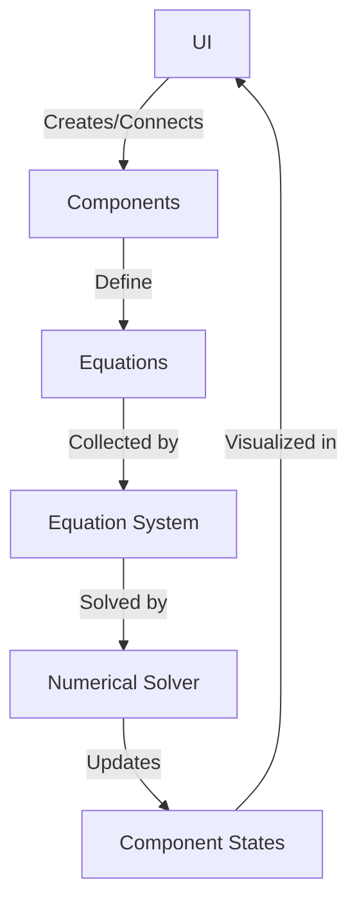

# Modelica-Godot Architecture

## Core Principles
1. **Acausal Modeling** - Components define bidirectional relationships without explicit flow direction
2. **Equation-Based** - Components describe behavior using equations rather than assignments
3. **Hierarchical Composition** - Models can be composed of other models
4. **Visual Assembly** - Components connected through a graphical interface

## Key Components

### 1. Connectors (`connector.gd`)
- Basic interface elements that define what can be connected
- Contains variables that represent flow and potential
- Examples:
  - Mechanical (force, position)
  - Electrical (current, voltage) 
  - Thermal (heat flow, temperature)

### 2. Components (`component.gd`)
- Building blocks that contain:
  - Connectors (ports)
  - Parameters (configurable values)
  - Variables (internal state)
  - Equations (behavior)

### 3. Equation System (`equation_system.gd`)
- Collects equations from all components
- Performs symbolic manipulation
- Solves system numerically
- Handles:
  - Algebraic equations
  - Simple differential equations
  - Basic discrete events

### 4. Model Manager (`model_manager.gd`)
- Maintains component hierarchy
- Handles connections
- Manages simulation lifecycle
- Provides API for UI interaction

## Implementation Phases

### Phase 1: Basic Framework
1. Core connector types
2. Simple component base class
3. Basic equation solver
4. Visual connection system

### Phase 2: Component Library
1. Basic mechanical components
2. Simple electrical elements
3. Thermal components
4. Source/sink elements

### Phase 3: Advanced Features
1. Units and validation
2. State events
3. Component composition
4. Model export/import

## Example Usage

```gdscript
# Define a simple mechanical spring
var spring = MechanicalComponent.new()
spring.add_connector("p1", MECHANICAL) # Port 1
spring.add_connector("p2", MECHANICAL) # Port 2
spring.add_parameter("k", 100.0) # Spring constant
spring.add_equation("f = k * (p1.x - p2.x)") # Hooke's law
spring.add_equation("p1.f + p2.f = 0") # Force balance
```

## Data Flow
