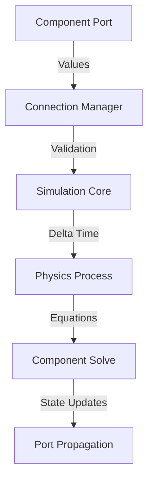
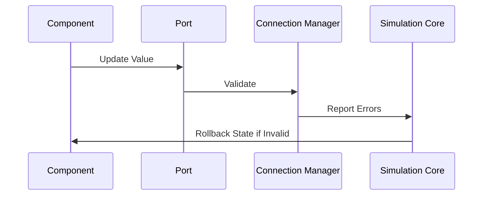

# LunCo Supply Chain Modeling Architecture

## Core Principles
1. **Acausal Modeling** - Components define relationships without directionality
2. **Node Responsibility** - Each node manages its own state and equations
3. **Bidirectional Flow** - Resources move based on system pressures, not predefined paths
4. **Physics Integration** - Native Godot physics process for time-stepped simulation

## Key Components

### 1. Port System (`port.gd`)
```gdscript
# Bidirectional connection points
enum PortType {FLOW, EFFORT}  # Through vs Across variables
- Automatic value propagation
- Range validation
- Type checking
```

### 2. Simulation Component (`simulation_component.gd`)
```gdscript
# Base class for all model elements
- Port management
- Equation definitions
- State tracking
- Error reporting
```

### 3. Connection Manager (`connection_manager.gd`)
```gdscript
# Handles component interconnections
- Bidirectional validation
- System-wide integrity checks
- Connection lifecycle management
```

### 4. Simulation Core (`simulation.gd`)
```gdscript
# Central simulation controller
- Three-phase update cycle:
  1. Equation solving
  2. State updates
  3. Error handling
- Time scale management
- Component registry
```

## Data Flow



## Component Types

### 1. Physical Components
- Storage tanks
- Pipes/Valves
- Production facilities
- Power systems

### 2. Abstract Components
- Mathematical operators
- Control systems
- Environmental models
- Resource converters

## Example: Oxygen System
```gdscript
# Create components
var tank = StorageTank.new()
var electrolyzer = OxygenGenerator.new()

# Connect using acausal ports
connection_manager.connect_components(
    tank, "pressure",
    electrolyzer, "h2o_pressure"
)

# Automatic behavior:
# 1. Pressure equilibrium calculation
# 2. Mass flow based on pressure differential
# 3. Emergency pressure relief handling
```

## Benefits
1. **Realistic Emergent Behavior** - System-wide effects from local interactions
2. **Model Reusability** - Components work in any compatible configuration
3. **Error Resilience** - Automatic validation and failure containment
4. **Performance** - Parallel equation solving using Godot's thread pool

## Validation System


## Extension Points
1. **New Port Types** - Add thermal/electrical properties
2. **Custom Solvers** - Implement different equation resolution strategies
3. **Visualization Hooks** - Connect to Godot's rendering system
4. **Import/Export** - Add Modelica/FMI compatibility

## Performance Characteristics
| Operation          | Complexity | Notes                          |
|---------------------|------------|--------------------------------|
| Port Connection     | O(1)       | Hash-based validation          |
| Equation Solving    | O(n)       | Parallelizable per component   |
| State Propagation    | O(log n)   | Optimized through port grouping|
| Error Handling      | O(m)       | Linear with connection count   | 