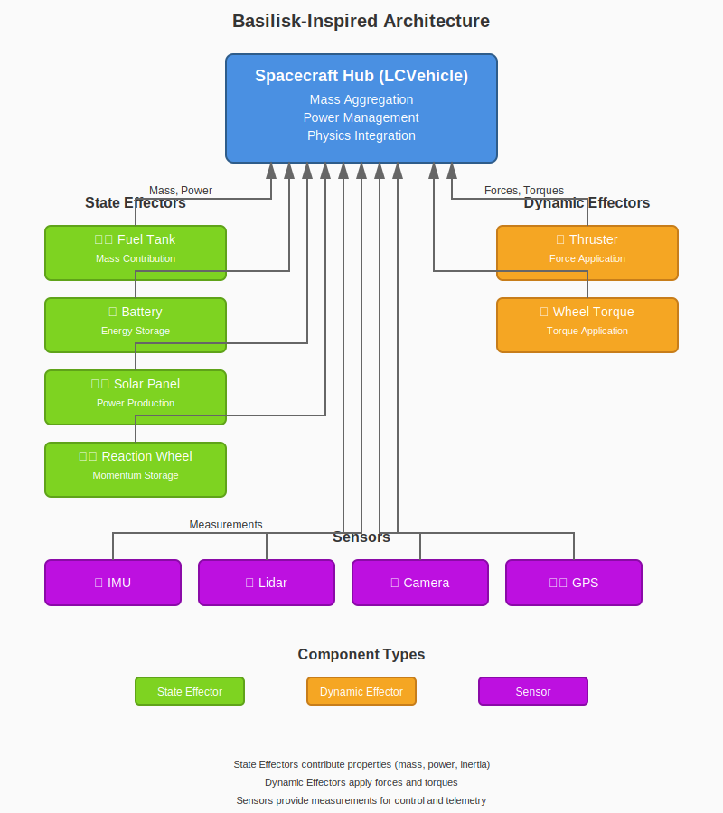

# Basilisk Architecture Quick Reference

> Quick reference for developers working with LunCoSim's Basilisk-inspired architecture

## Quick Links

- [Full Integration Guide](Basilisk-Architecture-Integration.md)
- [State Effector Base](../core/effectors/state-effector.gd)
- [Dynamic Effector Base](../core/effectors/dynamic-effector.gd)
- [Vehicle Hub](../core/base/vehicle.gd)

---

## Architecture Overview



*The effector-based architecture: State Effectors contribute properties, Dynamic Effectors apply forces, and Sensors provide measurements to the Vehicle Hub.*

---

## Core Concepts

### State Effector
**Passive** components that contribute properties to the vehicle
- Mass, inertia, center of mass
- Power consumption/production
- Do NOT apply forces/torques

### Dynamic Effector
**Active** components that apply forces and torques
- Compute force/torque each timestep
- Modify vehicle motion
- Can consume power

### Vehicle Hub
Central aggregator that:
- Discovers all effectors
- Aggregates mass properties
- Manages power system
- Applies forces from dynamic effectors

---

## Creating a New State Effector

```gdscript
class_name LCMyStateEffector
extends LCStateEffector

## Description of what this effector does

@export_group("Properties")
@export var my_property: float = 10.0

# Internal state
var current_value: float = 0.0

func _ready():
    super._ready()
    mass = 5.0  # Set component mass
    power_consumption = 2.0  # Set power draw
    _initialize_telemetry()

func _physics_process(delta):
    _update_state(delta)
    _update_telemetry()

## Override if mass changes dynamically
func get_mass_contribution() -> float:
    return mass  # Or calculate based on state

## Override if power changes dynamically
func get_power_consumption() -> float:
    return power_consumption  # Or calculate

func _initialize_telemetry():
    Telemetry = {
        "my_property": my_property,
        "current_value": current_value,
    }

func _update_telemetry():
    Telemetry["current_value"] = current_value

func _update_state(delta: float):
    # Your state update logic
    current_value += delta
    
    # Emit signal if mass changed
    if mass_changed_condition:
        mass_changed.emit()
```

---

## Creating a New Dynamic Effector

```gdscript
class_name LCMyDynamicEffector
extends LCDynamicEffector

## Description of what this effector does

@export_group("Force Properties")
@export var max_force: float = 100.0
@export var force_direction: Vector3 = Vector3.UP

# Control inputs
var force_command: float = 0.0  # 0.0 to 1.0

# Internal state
var current_force: float = 0.0

func _ready():
    super._ready()
    force_direction = force_direction.normalized()
    _initialize_telemetry()

func _physics_process(delta):
    _update_force(delta)
    _update_telemetry()

## Main interface: compute force and torque
func compute_force_torque(delta: float) -> Dictionary:
    if current_force <= 0.01:
        return {}
    
    # Calculate force in local frame
    var local_force = force_direction * current_force
    
    # Convert to global frame
    var global_force = local_to_global_force(local_force)
    
    return {
        "force": global_force,
        "torque": Vector3.ZERO,  # Add torque if needed
        "position": global_position
    }

## Set force command (0.0 to 1.0)
func set_force(level: float):
    force_command = clamp(level, 0.0, 1.0)

func _update_force(delta: float):
    var target_force = force_command * max_force
    # Add ramping if needed
    current_force = target_force

func _initialize_telemetry():
    Telemetry = {
        "force_command": force_command,
        "current_force": current_force,
    }

func _update_telemetry():
    Telemetry["force_command"] = force_command
    Telemetry["current_force"] = current_force
```

---

## Creating a Hybrid Effector

Some components are both state AND dynamic effectors (e.g., reaction wheels):

```gdscript
class_name LCMyHybridEffector
extends LCStateEffector  # Inherit from state

## Hybrid effector that contributes mass AND applies torque

@export var max_torque: float = 10.0

var torque_command: float = 0.0

func _ready():
    super._ready()
    mass = 2.0

## State effector interface
func get_mass_contribution() -> float:
    return mass

## Dynamic effector interface (duck-typed)
func compute_force_torque(delta: float) -> Dictionary:
    if abs(torque_command) < 0.01:
        return {}
    
    var torque = Vector3(torque_command, 0, 0)
    var global_torque = local_to_global_torque(torque)
    
    return {
        "torque": global_torque,
        "force": Vector3.ZERO,
        "position": global_position
    }

func local_to_global_torque(local_torque: Vector3) -> Vector3:
    return global_transform.basis * local_torque
```

---

## Common Patterns

### Depleting Resource (Fuel Tank)

```gdscript
func deplete_fuel(amount: float) -> float:
    var actual_depleted = min(amount, current_fuel)
    current_fuel -= actual_depleted
    
    # Update mass
    mass = dry_mass + current_fuel
    mass_changed.emit()
    
    return actual_depleted

func is_empty() -> bool:
    return current_fuel <= 0.0
```

### Power Generation (Solar Panel)

```gdscript
func _physics_process(delta):
    _update_sun_angle()
    _update_power_output()

func _update_power_output():
    if not is_deployed:
        current_power_output = 0.0
        return
    
    # Cosine law: power proportional to sun angle
    var cos_angle = panel_normal.dot(sun_direction)
    cos_angle = max(0.0, cos_angle)  # Only positive
    
    current_power_output = max_power_output * cos_angle * panel_efficiency

func get_power_production() -> float:
    return current_power_output
```

### Sensor Measurement with Noise

```gdscript
func _update_measurement():
    # Get true value
    var true_value = _get_true_measurement()
    
    # Add noise
    if add_noise:
        true_value = add_gaussian_noise(true_value)
    
    # Add bias
    if add_bias:
        true_value += bias_value
    
    measurement = true_value
    is_valid = true

func add_gaussian_noise(value: float) -> float:
    var u1 = randf()
    var u2 = randf()
    var noise = sqrt(-2.0 * log(u1)) * cos(2.0 * PI * u2) * noise_std_dev
    return value + noise
```

### Telemetry with Commands

```gdscript
func _initialize_telemetry():
    Telemetry = {
        "state": current_state,
        "value": current_value,
    }
    
    Commands = {
        "set_value": cmd_set_value,
        "reset": cmd_reset,
    }

func cmd_set_value(args: Array):
    if args.size() >= 1:
        set_value(args[0])

func cmd_reset(args: Array):
    reset_to_default()
```

---

## Vehicle Hub Usage

### Refreshing Effectors

After adding/removing components at runtime:

```gdscript
# Add new component
var new_tank = LCFuelTankEffector.new()
vehicle.add_child(new_tank)

# Refresh effector lists
vehicle.refresh_effectors()
```

### Accessing Effectors

```gdscript
# Find all fuel tanks
for effector in vehicle.state_effectors:
    if effector is LCFuelTankEffector:
        print("Fuel: ", effector.current_fuel)

# Find all thrusters
for effector in vehicle.dynamic_effectors:
    if effector is LCThrusterEffector:
        effector.set_thrust(0.5)
```

### Power Management

The vehicle hub automatically:
1. Aggregates power consumption from all effectors
2. Aggregates power production from solar panels
3. Charges/discharges batteries based on net power

```gdscript
# Check power status
print("Power consumption: ", vehicle.power_consumption, " W")
print("Power production: ", vehicle.power_production, " W")
print("Net power: ", vehicle.power_available, " W")
```

---

## Frame Conventions

### Local vs. Global Frames

- **Local Frame**: Relative to the component's transform
- **Global Frame**: World space coordinates

Always convert to global before returning from `compute_force_torque()`:

```gdscript
# CORRECT
var local_force = Vector3(0, thrust, 0)
var global_force = local_to_global_force(local_force)
return {"force": global_force}

# INCORRECT - Don't return local forces
return {"force": Vector3(0, thrust, 0)}
```

### Helper Methods

```gdscript
# Convert local force to global
func local_to_global_force(local_force: Vector3) -> Vector3:
    return global_transform.basis * local_force

# Convert local torque to global
func local_to_global_torque(local_torque: Vector3) -> Vector3:
    return global_transform.basis * local_torque

# Convert local direction to global
func local_to_global_direction(local_dir: Vector3) -> Vector3:
    return (global_transform.basis * local_dir).normalized()
```

---

## Performance Tips

### Use Dirty Flags

```gdscript
var mass_properties_dirty: bool = true

func _on_fuel_depleted():
    mass_properties_dirty = true

func _physics_process(delta):
    if mass_properties_dirty:
        _update_mass_properties()
        mass_properties_dirty = false
```

### Throttle Updates

```gdscript
var update_timer: float = 0.0
const UPDATE_RATE: float = 0.1  # 10 Hz

func _physics_process(delta):
    update_timer += delta
    if update_timer >= UPDATE_RATE:
        update_timer = 0.0
        _update_expensive_calculation()
```

### Avoid Per-Frame Queries

```gdscript
# BAD - Queries every frame
func _physics_process(delta):
    for effector in get_parent().find_children("*"):
        if effector is LCFuelTankEffector:
            # ...

# GOOD - Cache references
var fuel_tanks: Array = []

func _ready():
    fuel_tanks = get_parent().find_children("*").filter(
        func(n): return n is LCFuelTankEffector
    )

func _physics_process(delta):
    for tank in fuel_tanks:
        # ...
```

---

## Testing Effectors

### Create Test Scene

```gdscript
extends Node3D

@onready var vehicle: LCVehicle = $Vehicle
@onready var my_effector: LCMyEffector = $Vehicle/MyEffector

func _ready():
    print("=== Testing MyEffector ===")
    _test_mass_contribution()
    _test_force_application()

func _test_mass_contribution():
    var mass = my_effector.get_mass_contribution()
    print("Mass contribution: ", mass, " kg")
    assert(mass > 0, "Mass should be positive")

func _test_force_application():
    my_effector.set_force(1.0)
    var ft = my_effector.compute_force_torque(0.016)
    print("Force: ", ft.get("force", Vector3.ZERO))
    assert(ft.has("force"), "Should return force")
```

---

## Common Issues

### Issue: Mass not updating

**Cause**: Forgot to emit `mass_changed` signal

**Solution**:
```gdscript
func deplete_fuel(amount: float):
    current_fuel -= amount
    mass = dry_mass + current_fuel
    mass_changed.emit()  # Don't forget!
```

### Issue: Forces not applied

**Cause**: Not returning from `compute_force_torque()` or returning local frame

**Solution**:
```gdscript
# Return global frame forces
func compute_force_torque(delta: float) -> Dictionary:
    var global_force = local_to_global_force(local_force)
    return {"force": global_force, "position": global_position}
```

### Issue: Vehicle hub not finding effectors

**Cause**: Effector not a child of vehicle, or wrong inheritance

**Solution**:
```gdscript
# Ensure effector is in vehicle's scene tree
vehicle.add_child(effector)

# Ensure correct inheritance
class_name MyEffector
extends LCStateEffector  # or LCDynamicEffector
```

---

## Cheat Sheet

| Task | Code |
|------|------|
| Create state effector | `extends LCStateEffector` |
| Create dynamic effector | `extends LCDynamicEffector` |
| Return mass | `func get_mass_contribution() -> float` |
| Return power | `func get_power_consumption() -> float` |
| Apply force | `func compute_force_torque(delta) -> Dictionary` |
| Emit mass changed | `mass_changed.emit()` |
| Convert to global force | `local_to_global_force(local_force)` |
| Convert to global torque | `local_to_global_torque(local_torque)` |
| Refresh effectors | `vehicle.refresh_effectors()` |
| Add telemetry | `Telemetry["key"] = value` |
| Add command | `Commands["cmd_name"] = func_reference` |

---

**See Also**: [Full Integration Guide](Basilisk-Architecture-Integration.md)
