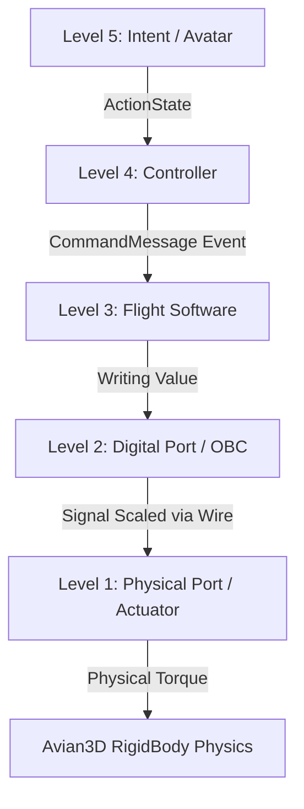

# Implementation Plan: 001-vessel-control-architecture

## Technology Stack

### Core Engine
- Engine: **Bevy** (Latest / 0.18+) - Selected for ECS modularity and high performance.
- Physics: **Avian3D** (Latest / 0.6+) - configured for `f64` precision. Required for planetary-scale operations and high-precision spacecraft maneuvering.
- Input Management: **Leafwing Input Manager** - Maps godot-style abstract Actions (Intent) to specific system commands.
- Floating Origin: **big_space** - Used to shift the f64 physics frame to f32 render coordinates to avoid jitter.

### Architecture Topology
- **Multi-Crate Workspace**: The project will be broken down into individual crates (`lunco-core`, `lunco-physics`, `lunco-fsw`, `lunco-obc`, etc.) to enforce strict separation of concerns and ensure features remain hotswappable plugins.

## Architecture

### System Overview

### Component Design

#### Crate 1: `lunco-core`
- **Responsibility**: Provides universal definitions (Ontology implementation).
- **Interfaces**: Defines `CommandMessage`, `DigitalPort` (i16), `PhysicalPort` (f32), and the `Wire` scale mapping.
- **Dependencies**: Bevy raw components.

#### Crate 2: `lunco-physics`
- **Responsibility**: Handles f64 double-precision entity state and Avian3D physics wrappers. Connects physics to `big_space` for origin shifting.
- **Interfaces**: Physics plugins, f64 offset transform updates.
- **Dependencies**: `lunco-core`, `avian3d`, `big_space`.

#### Crate 3: `lunco-obc`
- **Responsibility**: Hardware emulation of registers and digital-to-physical converters.
- **Interfaces**: Modifies `PhysicalPort` representations from `DigitalPort` inputs across `Wire` entities.
- **Dependencies**: `lunco-core`.

#### Crate 4: `lunco-fsw`
- **Responsibility**: Robotic logic and command translation (Level 3).
- **Interfaces**: Reads global `CommandMessage` events and translates them to `DigitalPort` assignments base on internal hardware maps.
- **Dependencies**: `lunco-core`.

#### Crate 5: `lunco-controller`
- **Responsibility**: Bridging Avatar input via `Leafwing Input Manager` into `CommandMessage` streams holding vehicle-agnostic instructions.
- **Dependencies**: `lunco-core`, `leafwing-input-manager`.

#### Core Embedded Testing
- **Responsibility**: `MockOBC` and `MockPlant` components inside module test scopes.
- **Interfaces**: Mocks hardware bounds and asserts signal isolation without heavy Avian3D contexts.

## Design Patterns

- **Action-to-Actuator 5-Layer Bus**: Strictly decouples logic layers. Level 4 cannot directly modify Level 1 attributes without passing through ports.
- **Headless-First Engine Modules**: Rendering and visual plugins should exist only in the root binary app execution (`lunco-client`) and should not be coupled with `lunco-physics` or `fsw`.
- **Plugin Registry**: Modules will expose base initialization logic wrapped in `impl Plugin`.

## Performance Strategy

- **f64-to-f32 Shift**: Avian computations at 64-bit precision ensure stability. GPU renders maintain near-zero relative position offsets using the `big_space` crate.
- **Headless Mode TDD**: Simulating the physics tick rate at high Hz values (1,000Hz) in headless scenarios allows for testing flight software accuracy instantly without rendering costs.
- **Headless Verifiers**: Integration tests run at terminal-speed natively checking layer isolation and signal accuracy matrix cases (F-01 to F-08).
