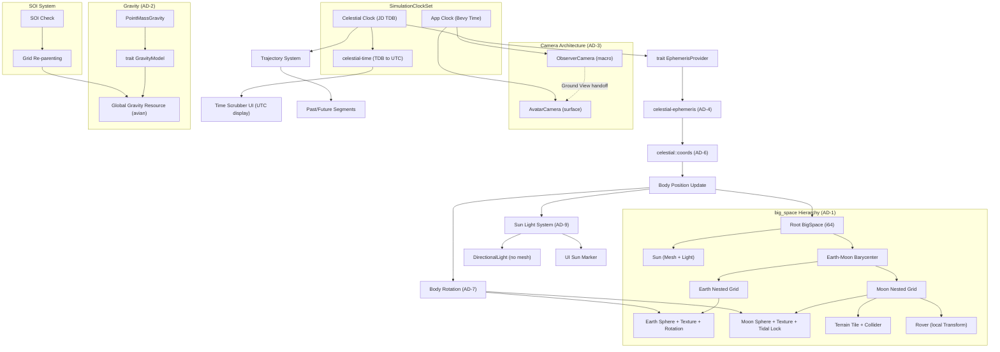

# Implementation Plan: 002-celestial-visualization

## Architecture Decisions Summary

| ID | Decision | Choice |
|:---|:---|:---|
| AD-1 | Spatial ownership | `lunco-celestial` owns `big_space`. **Golden Bridge**: Disable `TransformPlugin`, manual backfill for UI. |
| AD-2 | Gravity source | Global avian `Gravity` resource, set by celestial plugin. |
| AD-3 | Camera architecture | Two cameras. **Migration**: Camera re-parents to target grid ancestors for absolute precision. |
| AD-4 | Ephemeris source | `celestial-ephemeris` (alpha accepted). Behind `trait EphemerisProvider` for swappability. |
| AD-5 | Scenario system | Feature flags. Default = celestial. `--features sandbox` = flat ground. |
| AD-6 | Coordinate conversion | Shared `celestial::coords` utility. Ecliptic J2000 (AU) → Bevy (meters, Y-up). |
| AD-7 | Body rotation | Constant-rate. Earth: sidereal. Moon: tidally locked. Realistic Earth from Moon. |
| AD-8 | Skybox | Skipped for Phase 1. Black background. |
| AD-9 | Sun rendering | Physical mesh (`ico(4)`) in Solar Grid + directional light + UI marker. |
| AD-10 | Time conversion | `celestial-time` crate (TDB ↔ UTC). Comes with `celestial-ephemeris`. |
| AD-11 | Planet LOD | Single icosphere `ico(5)`. Hard cut to terrain. No billboard. |
| AD-12 | Sphere-terrain layering | Sphere stays visible under terrain tile. Tile offset `radius + 0.01m`. |
| AD-13 | Camera clip planes | Surface-Aware Dynamic `near` based on altitude. **Essential 10km clamp** for solar visibility. |

---

## Technical Strategy

### 1. Basic Clock Architecture (Foundation for `006`)

This spec implements the **minimum viable clock system** for celestial visualization and time scrubbing. The advanced Robotics Clock, PhysicsMode transitions, and integrator architecture remain in `006-time-and-integrators`.

- **`CelestialClock`**: JD TDB-based mission epoch (UTC conversion via `celestial-time` for UI display). Scrubbable from X1 to X1,000,000. Drives all ephemeris queries.
- **`AppClock`**: Standard Bevy `Time` (always 1.0×). Drives UI, Camera, and Avatar movement. Not affected by time scrubbing.

```rust
#[derive(Resource)]
pub struct SimulationClockSet {
    pub celestial: CelestialClock,
    // Robotics clock added by 006-time-and-integrators
}

pub struct CelestialClock {
    pub epoch: f64,            // Julian Date (TDB), f64 for sub-second precision
    pub speed_multiplier: f64, // 1.0 = real-time, up to 1_000_000.0
    pub paused: bool,
}
```

### 2. Extensible Body Registry

Bodies are described by data, not hardcoded spawn functions. The registry is a `Resource` that can be extended at runtime.

```rust
#[derive(Resource)]
pub struct CelestialBodyRegistry {
    pub bodies: Vec<BodyDescriptor>,
}

pub struct BodyDescriptor {
    pub name: String,
    pub ephemeris_id: EphemerisId, // NAIF ID (e.g., 10=Sun, 399=Earth, 301=Moon)
    pub radius_m: f64,
    pub gm: f64,                   // Gravitational parameter (m³/s²)
    pub soi_radius_m: Option<f64>, // None for Sun (infinite SOI)
    pub parent_id: Option<EphemerisId>,
    pub texture_asset: Option<String>,
    pub rotation_rate_rad_per_day: f64, // Sidereal rotation rate
    pub polar_axis: DVec3,              // Body's rotation axis (unit vector)
}
```

**Phase 1 bodies**: Sun (10), Earth-Moon Barycenter (3), Earth (399), Moon (301).
**Extension path**: Add Mars (499), Phobos (401), etc. by appending to the registry — no code changes.

### 3. `big_space` Integration — Hierarchical Local Grids (AD-1)

`lunco-celestial` owns all `big_space` setup. The engine's `TransformPlugin` is disabled to satisfy `big_space` 0.12.0 requirements.

```
BigSpace Root
├── Solar Grid (1e30m bounds, 1e9m cells)
│   ├── Sun Entity (Mesh + Light)
│   └── EMB Anchor (Sibling of Sun)
│       └── Earth-Moon-Barycenter Grid (1e30m bounds, 1e8m cells)
│           ├── Earth Anchor Grid (10km cells for local precision)
│           │   └── Earth Body Mesh
│           └── Moon Anchor Grid (10km cells for local precision)
│               └── Moon Body Mesh
```

**The Golden Bridge (UI Support)**: Since `TransformPlugin` is disabled, a custom system `fix_spatial_components_for_non_grid_entities` manually calculates `GlobalTransform` for entities WITHOUT `CellCoord` (UI, Windows, screen markers). This ensures full HUD interactivity.

**Floating Origin Migration**: The camera entity re-parents itself to the nearest `Grid` parent of its current focus target. This ensures the camera is always 'local' to its subject, providing sub-millimeter precision at the lunar surface.

**SOI Grid Re-parenting (Earth → Moon transfer):**
1. Entity's world-space `f64` position is computed from current grid cell + local transform
2. Entity is moved to the new body's nested grid (Bevy parent change)
3. New local `Transform` calculated relative to Moon's grid origin
4. Physics/rover crates see only a `Transform` update — transparent to them
5. Global `Gravity` updated to new body's surface gravity

### 4. Gravity — Global Resource (AD-2)

```rust
// lunco-celestial sets this based on nearest body
fn update_gravity(
    registry: Res<CelestialBodyRegistry>,
    camera: Query<&GlobalTransform, With<ObserverCamera>>,
    mut gravity: ResMut<Gravity>,
) {
    let nearest_body = find_nearest_body(&registry, &camera);
    let surface_g = nearest_body.gm / (nearest_body.radius_m * nearest_body.radius_m);
    gravity.0 = Vec3::new(0.0, -surface_g as f32, 0.0);
}
```

Existing physics crates read avian's `Gravity` resource unchanged. Zero modifications needed.

**Extension path**: Future upgrade to per-entity gravity for multi-body orbital simulation.

### 5. Pluggable Gravity Model (Trait Architecture)

```rust
pub trait GravityModel: Send + Sync + 'static {
    /// Compute gravitational acceleration at a position relative to the body center.
    fn acceleration(&self, position_relative: DVec3) -> DVec3;
}

/// Default implementation — sufficient for Phase 1.
pub struct PointMassGravity { pub gm: f64 }

impl GravityModel for PointMassGravity {
    fn acceleration(&self, pos: DVec3) -> DVec3 {
        let r_sq = pos.length_squared();
        let r = r_sq.sqrt();
        -pos * (self.gm / (r_sq * r))
    }
}
```

The trait exists for future extensibility (spherical harmonics, GMAT integration). Phase 1 only uses `PointMassGravity`. The global `Gravity` resource is derived from the nearest body's `PointMassGravity` evaluated at the surface.

### 6. Camera Architecture (AD-3)

**Two cameras, explicit handoff:**

| | ObserverCamera | AvatarCamera |
|:---|:---|:---|
| **Owner** | `lunco-celestial` | `lunco-avatar` |
| **Scale** | Solar system → surface approach | Surface-level, rover follow |
| **Zoom** | Exponential ($\Delta d = d \times k$) | Linear orbit distance |
| **Coordinates** | `big_space` grid-aware | Local `Transform` only |
| **Time** | AppClock | AppClock |
| **Active when** | Macro navigation | Ground View mode |

**Initial state**: ObserverCamera spawns focused on Earth at ~50,000 km distance in Earth's nested grid.

**Input gating**: Only the active camera's input systems run. An `ActiveCamera` marker component is moved between ObserverCamera and AvatarCamera during handoff. Both cameras' input systems use `With<ActiveCamera>` query filters.

**Transition flow:**
1. User zooms ObserverCamera to <1 km altitude on a body
2. User presses Ground View key
3. ObserverCamera deactivated (remove `Camera3d` or set `is_active: false`)
4. AvatarCamera spawned/activated at same position within body's nested grid
5. Terrain tile spawned with collision
6. Global `Gravity` set to body surface gravity
7. Rover spawning available

### 7. Ephemeris Strategy (AD-4)

**Single dependency: `celestial-ephemeris` (0.1.1-alpha.2).** Alpha risk accepted. Wrapped behind a trait for swappability.

```rust
/// Abstraction over ephemeris source — allows swapping crates later.
pub trait EphemerisProvider: Send + Sync + 'static {
    /// Position of body relative to its parent, in ecliptic J2000, AU.
    fn position(&self, body_id: EphemerisId, epoch_jd: f64) -> DVec3;
}

/// Default implementation using celestial-ephemeris crate.
pub struct CelestialEphemerisProvider { /* ... */ }
impl EphemerisProvider for CelestialEphemerisProvider { /* VSOP2013 + ELP/MPP02 */ }

// Future: VsopElpProvider using vsop87 + simple-elpmpp02
// Future: SpkProvider using raw JPL kernels
```

| Feature | Source | Accuracy |
|:---|:---|:---|
| Planetary positions (Sun, Earth) | VSOP2013 (built-in) | ~100 km |
| Moon position | ELP/MPP02 (built-in) | ~1 km |
| Artemis 2 trajectory | JPL SPK kernel (external `.bsp` file) | ~1 m |

No external data files needed for basic Sun/Earth/Moon visualization. SPK kernels are optional for high-precision trajectories.

**Fallback plan:** If `celestial-ephemeris` fails to compile or produces incorrect results, swap the `EphemerisProvider` implementation to `vsop87` 3.0.0 (planets) + `simple-elpmpp02` 0.1.0 (Moon). Zero changes to consuming systems.

### 8. Scenario System (AD-5)

```rust
// In lunco-client/src/main.rs

fn main() {
    let mut app = App::new();
    app.add_plugins(DefaultPlugins);

    #[cfg(not(feature = "sandbox"))]
    {
        // DEFAULT: Celestial world
        app.add_plugins(CelestialPlugin);
        app.add_systems(Startup, setup_celestial_scenario);
    }

    #[cfg(feature = "sandbox")]
    {
        // Flat-ground rover testing
        app.add_plugins(PhysicsPlugins::default());
        app.add_systems(Startup, setup_sandbox);
    }

    // Common plugins (physics, controller, FSW, etc.)
    app.add_plugins(LunCoCorePlugin);
    // ...
    app.run();
}
```

- `cargo run` → celestial world (default)
- `cargo run --features sandbox` → flat-ground rover sandbox

### 9. Basic Surface Terrain (AD-12: Sphere Stays Visible)

- **Flat rectangular mesh** tangent to body surface at lat/lon
- **Positioned at `body_radius + 0.01m`** — sits on top of the sphere mesh to avoid Z-fighting
- **Sphere mesh remains visible underneath** — provides continuous horizon (AD-12)
- **Configurable size**: 1×1 km to 10×10 km via `TerrainTileConfig` resource
- **Curvature error at 10km on Moon**: only 7.2m — invisible to the user
- **Collision**: avian `RigidBody::Static` + `Collider::cuboid`
- **Spawned dynamically**: When camera enters "near surface" threshold (default 50 km altitude)
- **Lives in body's nested `big_space` grid** — physics crates interact with it via local `Transform`

### 10. Lightweight Texturing

- **Earth**: Equirectangular PNG (<500KB) with continents. UV-mapped to sphere. Rotation applied per AD-7.
- **Moon**: Grayscale equirectangular PNG (<500KB) with major features. UV-mapped. Rotation applied per AD-7.
- **Sun**: Rendered as visible sphere mesh (AD-9) + `DirectionalLight` + UI screen-space marker.

### 11. Coordinate Conversion Utility (AD-6)

Shared module `celestial::coords` used by all systems that touch ephemeris positions:

```rust
mod coords {
    use bevy::math::DVec3;

    /// Obliquity of the ecliptic (J2000), radians
    const OBLIQUITY: f64 = 23.439_291_1_f64.to_radians(); // compile-time

    /// Convert ecliptic J2000 (AU) → Bevy world space (meters, Y-up)
    pub fn ecliptic_to_bevy(ecliptic_au: DVec3) -> DVec3 {
        // 1. Ecliptic → Equatorial (rotate around X by obliquity)
        let cos_e = OBLIQUITY.cos();
        let sin_e = OBLIQUITY.sin();
        let equatorial = DVec3::new(
            ecliptic_au.x,
            ecliptic_au.y * cos_e - ecliptic_au.z * sin_e,
            ecliptic_au.y * sin_e + ecliptic_au.z * cos_e,
        );
        // 2. Equatorial → Bevy (equatorial Y→Bevy Y (up), equatorial Z→Bevy -Z (forward))
        // 3. AU → meters
        const AU_TO_M: f64 = 149_597_870_700.0;
        DVec3::new(
            equatorial.x * AU_TO_M,
            equatorial.y * AU_TO_M,  // up
            -equatorial.z * AU_TO_M, // Bevy forward is -Z
        )
    }
}
```

### 12. Body Rotation (AD-7)

Simple constant-rate rotation applied as `Transform` rotation on each body entity:

```rust
/// Compute body rotation quaternion for a given epoch.
fn body_rotation(epoch_jd: f64, body: &BodyDescriptor) -> DQuat {
    let days_since_j2000 = epoch_jd - 2_451_545.0;
    let angle_rad = days_since_j2000 * body.rotation_rate_rad_per_day;
    // Rotate around body's polar axis (tilted by obliquity for Earth)
    DQuat::from_axis_angle(body.polar_axis, angle_rad)
}
```

- **Earth**: `rotation_rate = 2π / 0.99726968` rad/day (sidereal). Polar axis tilted 23.44° from ecliptic normal.
- **Moon**: Rotation rate = orbital angular velocity (~2π / 27.321661 rad/day). Same face always toward Earth (tidal locking).
- **Sun**: No rotation applied.
- The `BodyDescriptor` gains `rotation_rate_rad_per_day: f64` and `polar_axis: DVec3` fields.

### 13. Time Conversion (AD-10)

Use `celestial-time` (comes as a dependency of `celestial-ephemeris`):

- Internal: Julian Date TDB (`f64`) in `CelestialClock`
- UI display: UTC string via `celestial-time` conversion
- User input (date picker): UTC → JD TDB via `celestial-time`
- System clock initialization: current system time → JD TDB

### 14. Sun as Light Source (AD-9)

- **Sun carries a mesh** in the Solar Grid.
- **`DirectionalLight`**: Rotation computed from Sun's ephemeris position relative to camera focus body. Updated each frame.
- **UI marker**: Screen-space icon (small sun glyph) rendered at the projected Sun direction. Indicates where the Sun is even when not "visible."

### 15. Planet Rendering LOD (AD-11)

Single mesh per body, hard cut to terrain at altitude threshold:

| Camera Distance | What Renders | Method |
|:---|:---|:---|
| Solar Scale | Sun mesh + Planet ico(5) | Always present |
| Orbital (1000km) | Body ico(5) + Surface Texture | Always present |
| Near Surface (50km) | Body Mesh + Terrain Tile Overlay | AD-12 (on top) |
| Ground View (<1km) | Sphere (Horizon) + Terrain Tile (Ground) | Stable backdrop |

No billboard sprites for distant bodies in Phase 1. A 10,242-vertex icosphere renders in microseconds — GPU cost is negligible even when the body occupies 3 pixels.

**Extension path**: Add billboard phase for bodies subtending < 2px when rendering full solar system with many bodies.

### 16. Sphere-Terrain Layering (AD-12)

When terrain tiles are active, the sphere and tile coexist:

```
   Camera (looking at horizon)
       |
       v
   ____terrain tile (flat, at radius + 0.01m)____
  /                                               \
 /        sphere mesh (smooth, textured)            \
|              (visible at horizon)                   |
 \                body center                       /
  \_______________________________________________ /
```

**Curvature error** (how much a flat tile diverges from the sphere):
$h_{error} = R - \sqrt{R^2 - (d/2)^2}$

| Body | Radius (km) | Tile 1 km | Tile 10 km | Tile 50 km |
|:---|:---|:---|:---|:---|
| Moon | 1,737 | 0.07 m | 7.2 m | 180 m |
| Earth | 6,371 | 0.02 m | 1.96 m | 49 m |

**Maximum recommended tile size**: 10 km on Moon (7.2m error — invisible at ground level).

The terrain tile is offset `radius + 0.01m` from body center to sit just above the sphere surface. The `0.01m` offset prevents Z-fighting between tile and sphere at the tile's center point.

### 17. Dynamic Camera Clip Planes (AD-13)

```rust
fn update_clip_planes(
    q_camera: Query<(&GlobalTransform, &mut Projection), With<ActiveCamera>>,
    q_bodies: Query<(&GlobalTransform, &CelestialBody)>,
) {
    for (cam_gtf, mut proj) in q_camera.iter_mut() {
        if let Projection::Perspective(p) = proj.as_mut() {
            // Near plane scales with surface distance; max 10km clamp
            let min_surface_dist = calculate_min_surface_dist(cam_gtf, &q_bodies);
            p.near = (min_surface_dist * 0.001).max(0.1).min(10000.0) as f32;
            p.far = 1.0e15; // Universal solar visibility
        }
    }
}
```

| Altitude | Near Plane | Sees |
|:---|:---|:---|
| 1 m (surface) | 0.1 m | Rover wheel detail |
| 100 m (low flight) | 0.1 m | Terrain features |
| 10 km (high flight) | 10 m | Surface from above |
| 1,000 km (orbital) | 100 m | Whole body |
| 1 AU (solar) | 1,000 m | Stars & planets |

---

### 18. System Ordering (FR-026)

Systems MUST run in this deterministic order within each frame:

| Order | System | Schedule | Depends On |
|:---|:---|:---|:---|
| 1 | `celestial_clock_tick_system` | Update | Bevy `Time` |
| 2 | `time_warp_state_system` | Update | Clock speed |
| 3 | `ephemeris_update_system` | Update | Clock epoch |
| 4 | `body_rotation_system` | Update | Clock epoch, body data |
| 5 | `sun_light_update_system` | Update | Body positions |
| 6 | `soi_check_system` | Update | Entity positions |
| 7 | `update_global_gravity_system` | Update | SOI results |
| 8 | `terrain_spawn_system` | Update | Surface coordinates |
| 9 | `observer_camera_system` | Update | AppClock, input |
| 10 | `update_clip_planes_system` | PostUpdate | Camera altitude |

All celestial systems (1-8) are registered as `.chain()` in `CelestialPlugin`. Camera and clip systems run after.

### 19. TimeWarp ↔ Physics Interface (FR-027)

When the Celestial Clock speed exceeds X100, high-fidelity physics is meaningless. This spec defines the **interface**; the full PhysicsMode state machine is owned by `006-time-and-integrators`.

```rust
/// Published by lunco-celestial. Readable by physics crates.
#[derive(Resource)]
pub struct TimeWarpState {
    pub speed: f64,
    pub physics_enabled: bool, // false when speed > 100×
}
```

Physics crates gate their systems: `.run_if(|tw: Res<TimeWarpState>| tw.physics_enabled)`.

### 20. Input Conflict Resolution (FR-028)

Only the active camera consumes input. An `ActiveCamera` marker component is present on exactly one camera entity at all times.

```rust
#[derive(Component)]
pub struct ActiveCamera;

// Each camera's input system queries With<ActiveCamera>
fn observer_camera_input(
    q: Query<&mut ObserverCamera, With<ActiveCamera>>,
    // ...
) { /* only runs when this camera has ActiveCamera */ }
```

During handoff: (1) Remove `ActiveCamera` from source camera, (2) deactivate source, (3) add `ActiveCamera` to target, (4) activate target.

---

## Architecture Diagram



---

## Verification Plan

### Automated Tests

**Ephemeris & Positioning:**
- `test_earth_position_2026`: Compare Earth position from `celestial-ephemeris` VSOP2013 against JPL Horizons reference.
- `test_moon_position_2026`: Compare Moon position from ELP/MPP02 against reference.
- `test_barycenter_offset`: Verify Earth is offset from Earth-Moon barycenter by ~4,671 km.
- `test_body_hierarchy`: Verify parent-child relationships in the grid tree.

**Clock System:**
- `test_celestial_clock_tick`: Verify epoch advances correctly at X1, X100, X1M speeds.
- `test_celestial_clock_pause`: Verify epoch holds when paused while Bevy `Time` continues.
- `test_clock_independence`: Verify Bevy `Time` is unaffected by CelestialClock speed changes.

**Gravity:**
- `test_point_mass_gravity_earth`: Surface acceleration ≈ 9.81 m/s² at Earth's radius.
- `test_point_mass_gravity_moon`: Surface acceleration ≈ 1.625 m/s² at Moon's radius.
- `test_gravity_inverse_square`: Verify falloff at multiple distances.
- `test_global_gravity_update`: When nearest body changes, global `Gravity` resource updates.

**SOI & Grid Re-parenting:**
- `test_soi_boundary_moon`: Entity transitions from Earth SOI to Moon SOI at correct distance.
- `test_grid_reparenting`: Entity moved between grids has correct local Transform after.
- `test_reparenting_transparent`: Physics crate reads the same `Transform` component before and after re-parenting (values change, but the component is the same).

**Surface:**
- `test_surface_coordinates`: Lat/lon/alt computation for known positions on Moon.
- `test_terrain_tile_collision`: Spawn tile and rigid body, verify collision.
- `test_terrain_tile_size_config`: Verify configurable tile dimensions.

**Registry:**
- `test_registry_extensibility`: Add Mars at runtime, verify ephemeris position.

**Scenario System:**
- `test_sandbox_mode`: Verify flat-ground scenario loads without `big_space`.
- `test_celestial_mode`: Verify celestial scenario loads with full grid hierarchy.

**Headless:**
- `test_headless_full_cycle`: Run CelestialPlugin for 1000 ticks without a window. Deterministic output.

### Manual Verification

- Zoom from Earth to Moon with ObserverCamera; check for visual jitter at each scale transition.
- Scrub time using UI slider; check planetary movement and solar lighting updates.
- Enter Ground View on Moon; verify AvatarCamera activates and rover drives on terrain tile with Moon gravity.
- Return to ObserverCamera from Ground View; verify smooth transition.
- Verify Earth-Moon relative positions match real sky at a known date.
- Run `cargo run --features sandbox`; verify flat-ground rover sandbox loads.
